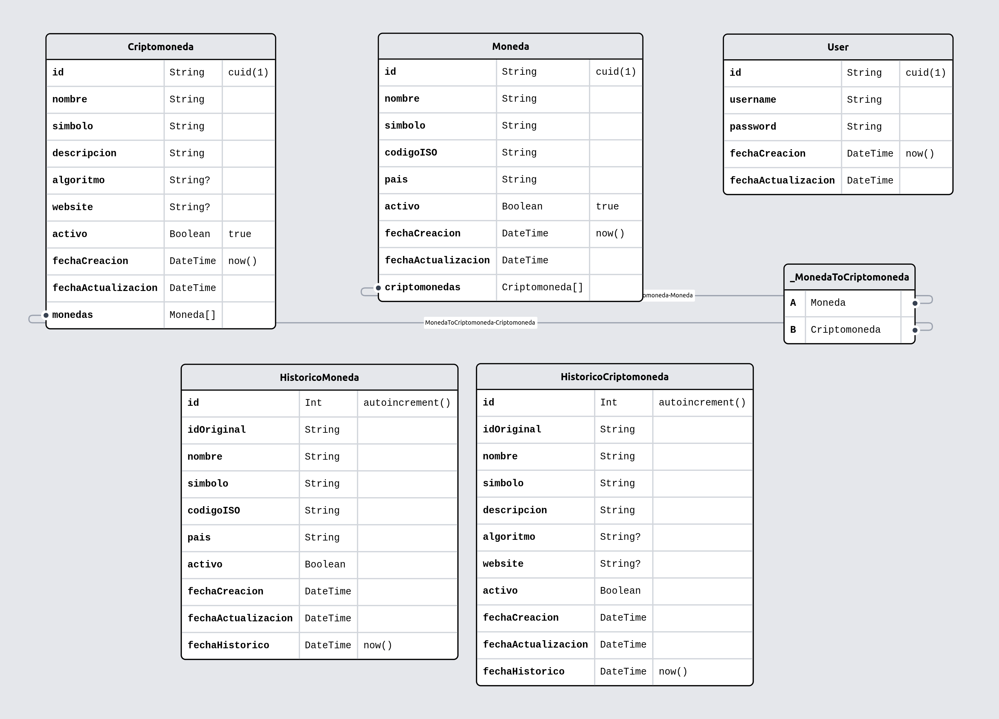

# Banking Technologies Consulting - Historic Microservice

### Es un servicio que permite respaldar en tablas historicas, monedas y criptomonedas, desde un endpoint

#### Instrucciones de instalacion

1. Unico requisito: Tener instalado node
2. El repositorio esta ubicado en: [repo](https://github.com/nestorcarrasquero/banking-microservice.git). Se puede descargar con el comando de GIT: git clone [repo](https://github.com/nestorcarrasquero/banking-microservice.git). Luego en la carpeta raiz del proyecto, se debe ejecutar el comando: pnpm install, con lo cual se instalaran las dependencias necesarias para levantar el proyecto
3. Para levantar el servicio, ejecutamos el comando: pnpm run dev, en la raiz del proyecto

| ENDPOINT | DESCRIPCION | METODO |
| --- | --- | --- |
| localhost:3010/api/history | Respaldo en Historico | POST |

